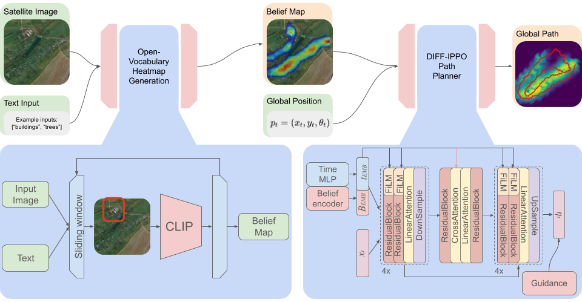

# DIFF-IPPO: Diffusion-Based Informative Path Planning for Multi-Agent Exploration



Welcome to the DIFF-IPPO repository! This project introduces **DIFF-IPPO**, a novel pipeline for informative path planning that leverages diffusion models to generate efficient trajectories over complex belief maps. Designed for exploration and search tasks, DIFF-IPPO enables robots to intelligently navigate environments by maximizing information gain.

## Overview

DIFF-IPPO is a new approach to informative path planning that combines an **open-vocabulary belief map generator** with a **diffusion-based trajectory planner**. Unlike traditional methods that rely on Gaussian assumptions, DIFF-IPPO can handle complex, non-Gaussian belief distributions, making it particularly effective in real-world scenarios where uncertainty is irregular and multimodal.

The system is designed for both **single-agent and multi-agent exploration**, allowing teams of robots (e.g., drones) to efficiently search large environments and detect targets faster.


## Repository Contents
* `aid_output_json/` – Contains output logs and results from AID planner runs.
* `scripts/iatitris.py` – Python implementation of the TIGRIS algorithm.
* `scripts/diff_ippo.py` – Implementation of the DIFF-IPPO planner.
* `img/` – Figures, diagrams, and visualizations used in the project.
* `test.ipynb` – Jupyter notebook with experiments, evaluations, and example usage.


## Getting Started

To run `test.ipynb` locally, first create and activate the Conda environment defined in `environment.yml`:

```bash
conda env create -f environment.yml
conda activate diffippo
```

Once activated, you can open and run the notebook:

```bash
jupyter notebook test.ipynb
```


## Citation

If you find this work useful, please consider citing:

```
@article{diff_ippo,
  title={DIFF-IPPO: Diffusion-Based Informative Path Planning for Multi-Agent Exploration},
  year={2026}
}
```


